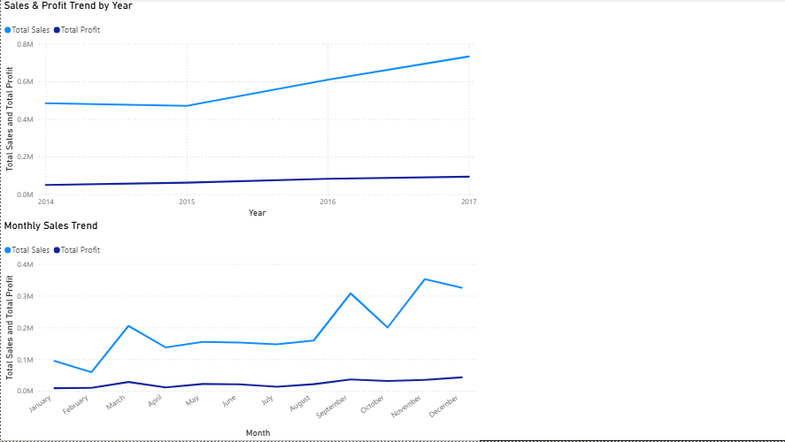

# Superstore Sales & Profit Analysis

## Project Overview

This project analyzes sales and profitability performance using the Superstore dataset.

The main objective is to identify key business trends, evaluate customer and product performance, compare regional, segment, and category performance, and identify opportunities for improving profitability.

SQL was used for data analysis and business queries, while Power BI was used to create an interactive dashboard and visualize the key findings.

Python and Microsoft Excel were also used during the initial data inspection and preparation stages.

---

## Business Questions

The project focuses on answering the following questions:

- What is the overall sales and profit performance?
- Which categories generate the highest sales and profit?
- Which regions perform best in terms of sales and profitability?
- Which customer segments contribute the most to sales and profit?
- Which customers generate the highest sales and profit?
- Which products generate the highest sales and profit?
- Which products generate losses?
- How do sales and profit change over time?
- Do high-sales customers and products always generate high profit?

---

## Dataset

The project uses the Superstore dataset, which contains sales transaction information including:

- Order Date
- Ship Date
- Customer Information
- Segment
- Region
- Category
- Sub-Category
- Product Information
- Sales
- Quantity
- Discount
- Profit

The dataset contains approximately 10,000 transaction records.

---

## Tools & Technologies

- Python
- Pandas
- Microsoft Excel
- MySQL
- SQL
- Microsoft Power BI
- DAX

---

## Project Workflow

### 1. Data Preparation

The dataset was inspected and prepared before performing the analysis.

Python and Excel were used during the initial stages for data inspection and preparation.

### 2. SQL Analysis

MySQL was used to perform business-oriented analysis, including:

- Data exploration
- Aggregation and grouping
- Customer analysis
- Product analysis
- Category analysis
- Regional analysis
- Segment analysis
- Time-based analysis
- Profitability analysis
- Loss-making product analysis
- Subqueries
- Common Table Expressions (CTEs)
- Window functions

### 3. Power BI Dashboard

Power BI was used to create an interactive dashboard containing:

- KPI Cards
- Sales & Profit by Category
- Sales by Region
- Sales by Segment
- Top Customers
- Top Products
- Profit Analysis
- Loss-Making Products
- Yearly Trends
- Monthly Trends
- Interactive Slicers

---

## Key Business Insights

### Overall Performance

The analysis provides an overview of the company's sales, profit, orders, customers, and profit margin performance.

### Category Performance

Technology generated the highest sales among the three main categories.

The comparison between sales and profit also shows that sales contribution does not always directly correspond to profitability.

### Regional Performance

The West region generated the highest sales at **$725,457.82** and achieved the highest profit margin at **14.94%**.

The Central region generated **$501,239.89** in sales but had the lowest profit margin at **7.92%**.

### Segment Performance

The Consumer segment generated the highest sales at **$1,161,401.35**, representing **50.56%** of total sales.

It also generated the highest profit at **$134,119.21**, representing **46.83%** of total profit.

### Customer Performance

Some customers generated both strong sales and high profitability.

For example:

- Tamara Chand: **$19,052.22 Sales** and **$8,981.32 Profit**
- Raymond Buch: **$15,117.34 Sales** and **$6,976.10 Profit**

### Product Performance

The Canon imageCLASS 2200 Advanced Copier generated **$61,599.82** in sales and **$25,199.93** in profit.

The analysis also identified products with negative total profit, including:

- Cubify CubeX 3D Printer Double Head Print: **-$8,879.97**
- Lexmark MX611dhe Monochrome Laser Printer: **-$4,589.97**
- Cubify CubeX 3D Printer Triple Head Print: **-$3,839.99**

### Monthly Performance

Among the strongest sales months identified in the analysis:

- September: **$307,649.95**
- November: **$352,461.07**
- December: **$325,293.50**

### Overall Sales vs. Profit Insight

One of the main findings from the analysis is that high sales do not always translate into high profitability.

Therefore, Sales, Profit, and Profit Margin should be evaluated together when assessing business performance.

---

## Business Recommendations

Based on the analysis:

- Monitor profit margin alongside sales when evaluating performance.
- Investigate products with negative total profit.
- Evaluate high-sales customers and products based on profitability as well as revenue.
- Focus on products and customer groups that generate strong profitability.
- Use seasonal sales trends to support inventory and marketing planning.
- Investigate regions with lower profit margins to identify potential pricing, discount, or cost-related issues.

---

## Dashboard Preview

### Overall Dashboard


### Customer Analysis


### Product Analysis


### Segment & Region Analysis


### Trends Analysis



---

## Project Structure

```text
Ecommerce_Sales_Analysis/
│
├── Data/
├── Python/
├── Power BI/
├── SQL/
├── Notes/
├── Reports/
├── Images/
└── README.md
**